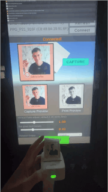

# Unity-PeripagePrinter

To support that tiny Peripage printer for Unity.

Partially Vibe-coded.

# Structure:
- ✅Assembly Definition:`PeripagePrinter.Runtime`
- ✅NameSpace: `PeripagePrinter.Runtime`
- ✅#region define 
- ✅Commented with other git repo used as ref
- ✅Demo Scene with UI support

# Support
- Mac OS Unity Editor plugin is working.

- Android plugin to support Kiosk Touch Display:
```bash
rockchip rk3288 
Android OS 7.1.2 
API Level 25
```

# Contributing
It's free; have fun :) 

Ping me if you need more support with the tiny printer ^_^!

# SubModule in Unity:

```bash
git submodule add git@github.com:samavan/Unity-PeripagePrinter.git Assets/Packages/Unity-PeripagePrinter/
```

# Other plugins
To support the plugin as a submodule in another Unity project, I removed `IngameDebugConsole`.

You can import it again in your project : 
- https://assetstore.unity.com/packages/tools/gui/in-game-debug-console-68068?srsltid=AU7gw4X173neRcCW8dXyC3MbjJM5Ps7NKHCH3ykVk18LMOckIAjfNQF2

It is already supported in the `.gitignore`.

# Unity Version
Tested with `Unity 6000.4.4f1`

# Preview


